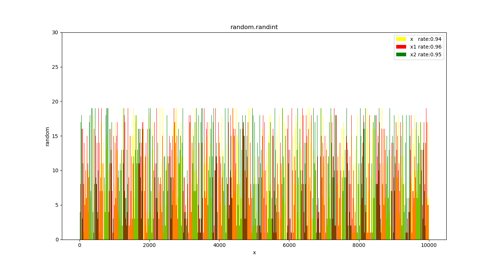
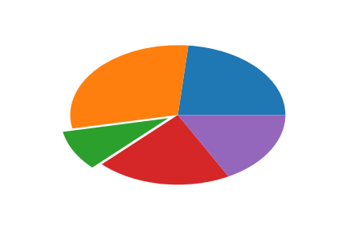
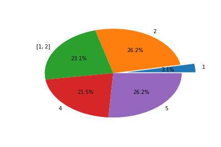
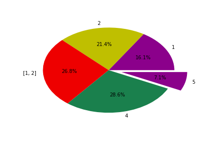
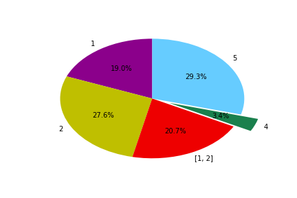

# __笔记__

[TOC]

## 1、Python Matplotlib

### 1.1、直方图绘制

```
import numpy as np
import matplotlib.pyplot as plt

a = np.random.randint(0,20,10000)
b = np.arange(1,10001)
y = a[0::3]
y1 = a[1::3]
y2 = a[2::3]

x = b[0::3]
x1 = b[1::3]
x2 = b[2::3]

rate = (len(y) - list(y).count(0))/len(y)
rate1 = (len(y1) - list(y1).count(0))/len(y1)
rate2 = (len(y2) - list(y2).count(0))/len(y2)

# plt.bar(x, y, color='', label='', width=1]) width为1时，数据之间没有空隙
plt.bar(x, y, color='yellow', label="x   rate:{0:.2f}".format(rate),width=1)
plt.bar(x1, y1, color="red",label="x1 rate:{0:.2f}".format(rate1), width=1)
plt.bar(x2, y2, color="green", label='x2 rate:{0:.2f}'.format(rate2), width=1)

plt.legend() # 自 动 添 加 bar 图 例
plt.ylim(0,30) # 设 置 y 轴 的 最 大 高 度

plt.ylabel("random")
plt.xlabel("x")
plt.title("random.randint")
plt.show()
```


### 1.2、饼图

```
def pie(
        x, explode=None, labels=None, colors=None, autopct=None,
        pctdistance=0.6, shadow=False, labeldistance=1.1,
        startangle=None, radius=None, counterclock=True,
        wedgeprops=None, textprops=None, center=(0, 0), frame=False,
        rotatelabels=False, *, data=None):
    return gca().pie(
        x, explode=explode, labels=labels, colors=colors,
        autopct=autopct, pctdistance=pctdistance, shadow=shadow,
        labeldistance=labeldistance, startangle=startangle,
        radius=radius, counterclock=counterclock,
        wedgeprops=wedgeprops, textprops=textprops, center=center,
        frame=frame, rotatelabels=rotatelabels, **({"data": data} if
        data is not None else {}))
```
|参数|意义|举例/结果|
|:-:|:-:|:-:|
|x|类似于**一 维** 数组||
|explode=_None_|就是每个模块与中心的距离。如果指定，就要**每个模块**都指定|explode_[2] = 0.1
|autopct=_None_|显示百分比的格式|ausopct="%.1%%"
labels=_None_|显示标签的内容，强行当作一维List_like|
colors=_None_|**列表**传参:支持16进制，单字母，英文代码，(0\~1,0\~1,0\~1)|colors=["DarkMagenta",'y','#ee0000',(0.1,0.5,0.3)]
startangle=_None_|逆时针旋转角度，以第一个块的右边半径为坐标轴，旋转|startangle=90
radius=_None_|radius默认为1|radius=1.5
wedegrops=_None_|
textprops=_None_|
data=_None_|

## 2、格式化输出

[format]("https://www.runoob.com/python/att-string-format.html")

|数字|格式|输出|描述|
|-|-|-|-|
|3.1415926 |{:.2f}|3.14|保留小数点后两位
3.1415926|{:+.2f}|+3.14|带符号保留小数点后两位
-1|{:+.2f}|-1.00|带符号保留小数点后两位
2.71828|{:.0f}|3|不带小数
5|{:0>2d}|05|数字补零 (填充左边, 宽度为2)
5|{:x<4d}|5xxx |数字补x (填充右边, 宽度为4)
10|{:x<4d}|10xx |数字补x (填充右边, 宽度为4)
1000000|{:,}|1,000,000 |以逗号分隔的数字格式
0.25|{:.2%}|25.00% |百分比格式
1000000000|{:.2e}|1.00e+09 |指数记法
13|{:10d}||右对齐 (默认, 宽度为10)
13|{:<10d}||左对齐 (宽度为10)
13|{:^10d}||中间对齐 (宽度为10)

## 3、数据类型转化

|函数|说明|
|-|-|
|int(x [,base ])|将x转换为一个整数
|long(x [,base ])|将x转换为一个长整数
|float(x )|将x转换到一个浮点数
|complex(real [,imag ])|创建一个复数
|str(x )|将对象 x 转换为字符串
|repr(x )|将对象 x 转换为表达式字符串
|eval(str )|用来计算在字符串中的有效表达式,并返回一个对象
|tuple(s )|将序列 s 转换为一个元组
|list(s )|将序列 s 转换为一个列表
|chr(x )|将一个整数转换为一个字符
|unichr(x )|将一个整数转换为Unicode字符
|ord(x )|将一个字符转换为它的整数值
|hex(x )|将一个整数转换为一个十六进制字符串
|oct(x )|将一个整数转换为一个八进制字符串