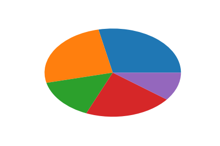
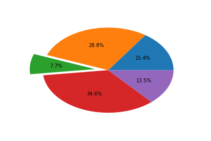
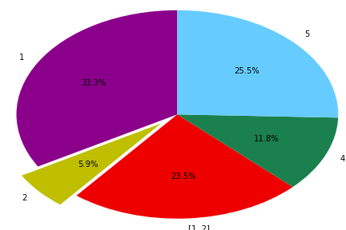

&emsp;&emsp;

# __笔记__

[TOC]

## 1、Python Matplotlib

### 1.1、直方图绘制

```python
#!/usr/bin/python3

import numpy as np
import matplotlib.pyplot as plt

a = np.random.randint(0,20,10000)
b = np.arange(1,10001)
y = a[0::3]
y1 = a[1::3]
y2 = a[2::3]

x = b[0::3]
x1 = b[1::3]
x2 = b[2::3]

rate = (len(y) - list(y).count(0))/len(y)
rate1 = (len(y1) - list(y1).count(0))/len(y1)
rate2 = (len(y2) - list(y2).count(0))/len(y2)

# plt.bar(x, y, color='', label='', width=1]) width为1时，数据之间没有空隙
plt.bar(x, y, color='yellow', label="x   rate:{0:.2f}".format(rate),width=1)
plt.bar(x1, y1, color="red",label="x1 rate:{0:.2f}".format(rate1), width=1)
plt.bar(x2, y2, color="green", label='x2 rate:{0:.2f}'.format(rate2), width=1)

plt.legend() # 自 动 添 加 bar 图 例
plt.ylim(0,30) # 设 置 y 轴 的 最 大 高 度

plt.ylabel("random")
plt.xlabel("x")
plt.title("random.randint")
plt.show()
```


### 1.2、饼图

```python
#!/usr/bin/python3

def pie(
        x, explode=None, labels=None, colors=None, autopct=None,
        pctdistance=0.6, shadow=False, labeldistance=1.1,
        startangle=None, radius=None, counterclock=True,
        wedgeprops=None, textprops=None, center=(0, 0), frame=False,
        rotatelabels=False, *, data=None):
    return gca().pie(
        x, explode=explode, labels=labels, colors=colors,
        autopct=autopct, pctdistance=pctdistance, shadow=shadow,
        labeldistance=labeldistance, startangle=startangle,
        radius=radius, counterclock=counterclock,
        wedgeprops=wedgeprops, textprops=textprops, center=center,
        frame=frame, rotatelabels=rotatelabels, **({"data": data} if
        data is not None else {}))
```

|参数|意义|举例/结果|
|:-:|:-:|:-:|
|x|类似于**一 维** 数组||
|explode=_None_|就是每个模块与中心的距离。如果指定，就要**每个模块**都指定|explode_[2] = 0.1
|autopct=_None_|显示百分比的格式|ausopct="%.1%%"
labels=_None_|显示标签的内容，强行当作一维List_like|
colors=_None_|**列表**传参:支持16进制，单字母，英文代码，(0\~1,0\~1,0\~1),__周末有时间写随机颜色脚本__|colors=["DarkMagenta",'y','#ee0000',(0.1,0.5,0.3)]
startangle=_None_|逆时针旋转角度，以第一个块的右边半径为坐标轴，旋转|startangle=90
radius=_None_|radius默认为1|radius=1.5
wedegrops=_None_|略
textprops=_None_|略
data=_None_|

### 1.3、 折线图

```python
#!/usr/bin/python3
import matplotlib.pyplot as plt

```

## 2、格式化输出

[format]("https://www.runoob.com/python/att-string-format.html")

|数字|格式|输出|描述|
|-|-|-|-|
|3.1415926 |{:.2f}|3.14|保留小数点后两位
3.1415926|{:+.2f}|+3.14|带符号保留小数点后两位
-1|{:+.2f}|-1.00|带符号保留小数点后两位
2.71828|{:.0f}|3|不带小数
5|{:0>2d}|05|数字补零 (填充左边, 宽度为2)
5|{:x<4d}|5xxx |数字补x (填充右边, 宽度为4)
10|{:x<4d}|10xx |数字补x (填充右边, 宽度为4)
1000000|{:,}|1,000,000 |以逗号分隔的数字格式
0.25|{:.2%}|25.00% |百分比格式
1000000000|{:.2e}|1.00e+09 |指数记法
13|{:10d}||右对齐 (默认, 宽度为10)
13|{:<10d}||左对齐 (宽度为10)
13|{:^10d}||中间对齐 (宽度为10)

## 3、数据类型转化

|函数|说明|
|-|-|
|int(x [,base ])|将x转换为一个整数
|long(x [,base ])|将x转换为一个长整数
|float(x )|将x转换到一个浮点数
|complex(real [,imag ])|创建一个复数
|str(x )|将对象 x 转换为字符串
|repr(x )|将对象 x 转换为表达式字符串
|eval(str )|用来计算在字符串中的有效表达式,并返回一个对象
|tuple(s )|将序列 s 转换为一个元组
|list(s )|将序列 s 转换为一个列表
|chr(x )|将一个整数转换为一个字符
|unichr(x )|将一个整数转换为Unicode字符
|ord(x )|将一个字符转换为它的整数值
|hex(x )|将一个整数转换为一个十六进制字符串
|oct(x )|将一个整数转换为一个八进制字符串

## 4、linux——awk命令

```bash
#!/usr/bin/bash

花括号两边必须是单引号
# 基操
awk '{pattern + action}' {filenames}

# 分隔符可以是列表
awk -F"分隔符" '{pattern + action}' {filenames}
awk -F"["\t",':']" '{pattern + action}' {filenames}

# 选择第20-30行
# if的条件必须加括号
awk '{if(NR>=20 && NR<=30) print $1}' {filenames}

# BEGIN
awk '{count++;print $0;} END{print "user count is ",count}' {filename}
# END
awk 'BEGIN {count=0;print "[start] user count is ",count} {count=count+1;print $0} END{print "[end] user count is ",count}' {filename} 

# awk '布尔表达式{action}' file 仅当对前面的布尔表达式求值为真时， awk 才执行代码块。
awk -F: '$1=="root"{print $0}' {filename}
awk -F: '($1=="root")&&($5=="root") {print $0}' {filename}
```

## 5、pandas

### 5.1.1 读取数据
```python
#!/usr/bin/python3

import pandas as pd

# header默认第一行
df = pd.read_csv("file_neme" [,sep="", header=True])

```

### 5.1.2 保存
```python
#!/usr/bin/python3
result.to_csv(output_file, sep="", header=True, index=True)
```

### 5.2 筛选
```python
#!/usr/bin/python3

# 选取f中第0列包含list_like中的数据的行
df[df[0].isin(list_like)]

# 选取f中第0列不包含list_)like中数据的行
# ~  表示反选
reault = df[~df[0].isin(list_like)]

# 模糊筛选　（包含什么）

## 单条件
df.loc[df[0].str.contains("GendId")]
## 多条件 不能用　＇＆＇只能用｜
df.loc[df[0].str.conrains("GenId|GenLenth")]


# 组合筛选时，每个条件都要添加括号
df2 = df[(df[3]>95) & (df[3]<96)]
```

### 5.3 访问数据
```python
#!/usr/bin/python3

# 因为人为规定的索引值可能会有重复，而索引位置不会重复

df.loc['索引']# 就是index，按照index的值来访问.它的类型根据index的类型改变
df.loc[行索引名称或条件，列索引名称]

df.iloc[int]# iloc只接受int，它表示第几行，从0开始
df.iloc[行索引位置，列索引位置]
```

### 5.4 更改数值
```python
#!/usr/bin/python3

df.loc[0] = [..,  ..., ..., ... ]# 在原来的基础上改变值

df.loc[行值，列值] # 精准定位到某个数据进行更改
df.iloc['index_seq','column']# 同上

## 重命名索引值、列名

frame9.rename(index,columns,inplace=False) # 默认不替换原数据

frame9.rename(index={1:'first'},columns={'item':'object'},inplace=True)

##　寻找替换
#＃ 然后需要再赋值给原来的表的列名才行
df["列名"].str.replace("","")

```

### 5.5 添加数据
```python
#!/usr/bin/python3

df.insert(第几列, "新列名", [数据]) # 在第几列添加新的列，列名是什么，数据
# 按列添加

col_name = df.columns.tolist()# 读取df列名为 list
col_name.insert(1,'D') # 就是对列表进行操作

df.reindex(columns=col_name)# 然后根据列名，重新排序df

# 利用 list.index的方法 ，
col_name.insert(col_name.index('B'),'D')# 在 B 列前面插入
df.reindex(columns=col_name)

col_name.insert(col_name.index('B')+1,'D') # 在 B 列后面插入
df.reindex(columns=col_name)

# 按行添加数据
temp=pd.DataFrame(like_list)
df.append(temp, ignore_index=True)

# 在某一行添加数据暂时不考虑，因为如果在不同位置添加多个数据，名称和索引位置会改变,比较麻烦
# 大多数思想都是拆表添加再合并

```

### 5.6 重复值处理

```python
#!/usr/bin/python3

#  会对每个数据计数，重复返回True，否则返回False
df.drop_duplicates(subset,keep)

# 根据sunset中的列名进行重复值去除
# 缺省subset——根据所有的列进行去重
# 缺省keep——保留第一个值   False——不保留所有重复值, last——保留最后一个, first——保留第一个
df.drop_duplicates(subset=[列名称1, 列名称2 ],keep)
```

### 5.7 排序

```python
#!/usr/bin/python3

df.sort_value(by=[], axsi=0, ascending=[],inplace=False,na_position='last')

# 根据低１，２，column_name3排序，
# 分别是升序，降序，升序,
# 并且直接作用于原来的数据表
df.sort_value(by=[1,2,column_name3,...], ascending=[True,False,True], inplace=True)
```

## 6、匿名函数


```python
#!/usr/bin/python3

# lambda 表达式
正确:       lambda x,y:x+y  
错误表达:    lambda x,y:a=x+y

# 对可迭代对象中的每一个元素进行function操作
map( function, iterable )

# reduce 连续映射
from functools import reduce
reduce(lambda x,x+y, list_x [,初始值/list_like])

# 过滤函数
filter ( lambda x: True if x==1 else False, list_like )

# 结合后的例子
map( lambda x: 满足条件返回值 if 条件 else 不满足条件返回值 ,iterable )

# 可同时迭代两个对象
map( lambda x,y: True_value if condition else False_value, iterable_1,iterable_2 )

```

## 7、 生物信息中常见的数据记录格式

### 7.1、 .fastq

每条reads只占用4行

第一行就是Sequence Identity
第二行是测序得到的碱基
第三行是单独的 **+**
第四行是碱基质量

Sequence Identity
```
@<Instrument>:<Run Number>:<Flowcell ID>:<Lane>:<Title>:<x-pox>:<y-pos>:<Read>:<Is filtered>:<Control number>:<Index sequence>
```

格式如下：


### 7.2、 .fasta

每条序列占两行

第一行 以 **>** 开头，接着是sequence header(uniqueness)
下一行 是碱基序列

格式：
&emsp;&emsp;省略


## 8．Shell

```shell
# 递归复制多个目录的相同文件
cp -r /share/data7/zhangy2/projects/2019-07-19/３.anno/*/*/*.sort.depth.log  ./
```

